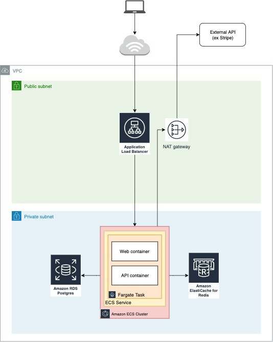

This proof of concept deploys two different containers (API and Web) in an ECS Fargate Task, a Redis cluster using ElastiCache, and a Postgres DB using RDS. It provisions all necessary networking (VPCs, Security Groups, subnet group assignment, etc) following best practices. The API and Web containers run node and are setup for the following:

#### API resources:
* GET /api/healthcheck
  * returns status code 200 with text "Successful healthcheck!" for ALB healthcheck
* GET /api/random-number
  * returns random number between 0 and 100 (inclusive of both 0 and 100)
* GET /api/postgres-select-version
  * NOTE: you will need to update the `SecretId` parameter by retrieving the "Secret name" from [AWS Secrets Manager](https://console.aws.amazon.com/secretsmanager/home) after running `cdk deploy` for the first time
  * gets DB conenction string, username, password, etc from AWS Secrets Manager, connects to the Postgres instance, and runs `SELECT version();`
* NOTE: All paths of API resources are prefixed with `/api`, which is configured at the Application Load Balancer level. Requests that match `/api/*` are routed to the API container(s) and all other requests are routed to the Web container(s). See the [targetGroups](https://github.com/jordan-patapoff/how-to-bring-a-containerized-web-app-online-in-12-minutes/blob/master/extended-examples/two-containers-redis-postgres/cdk-app-stack.ts#L55) configuration of the `ApplicationMultipleTargetGroupsFargateService` for more detail.

#### Web resources:
* GET /
  * returns status code 200 with text "Web app"
* GET /redis-server-info
  * NOTE: you will need to update the `host` parameter by retrieving the "Primary Endpoint" from [Amazon ElastiCache](https://console.aws.amazon.com/elasticache/home) after running `cdk deploy` for the first time
  * connects to Redis cluster and returns [client.server_info](https://www.npmjs.com/package/redis#clientserver_info)
* GET /random-number-api-service-call
  * makes an HTTP request to the API running in the same ECS Task localhost:8888/api/random-number and returns the random number

#### Instructions:
1) From the root-level [README](https://github.com/jordan-patapoff/how-to-bring-a-containerized-web-app-online-in-12-minutes/blob/master/README.md), complete steps 1-3 and 5-10
2) Drag & drop the `api-app` and `web-app` folders into the Cloud9 file explorer
3) In Cloud9 file browser, expand `cdk-app` then expend `lib`. Drag & drop the downloaded `cdk-app-stack.ts` file **from this folder** into the `lib` folder, overwriting the existing file.
4) `npm install @aws-cdk/core @aws-cdk/aws-ec2 @aws-cdk/aws-ecs @aws-cdk/aws-ecr @aws-cdk/aws-ecr-assets @aws-cdk/aws-ecs-patterns @aws-cdk/aws-elasticloadbalancingv2 @aws-cdk/aws-elasticache @aws-cdk/aws-rds @aws-cdk/aws-iam`
5) Run `cdk deploy`
6) After command completes, update the `SecretId` parameter in the API's server.js and the `host` parameter in the Web's server.js (see above sections for more detail)
7) Run `cdk deploy` again
8) Test demo using API and Web resources specified above

### Considerations for this solution:
* The two containers (API and Web) are deployed to the same ECS Task:
  * enables cross-service calls over localhost
  * API and Web must scale together 1:1
* The `ApplicationMultipleTargetGroupsFargateService` construct allows you to set `pathPattern` for each Target Group, enabling path-based routing to the API container (ex `/api/*`)
  
